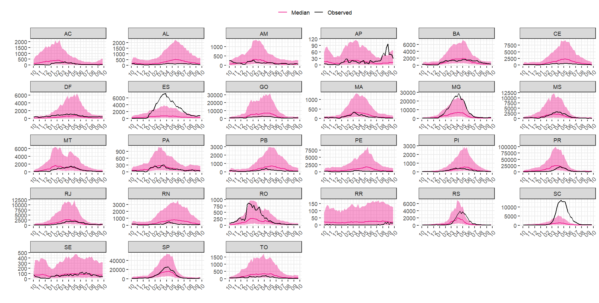
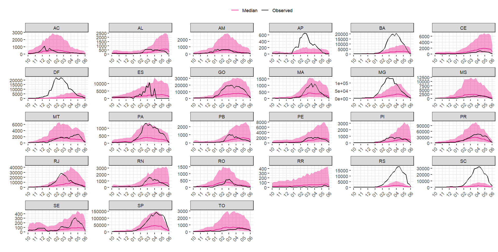

# LSL model for the infodengue sprint
This repo contains the models used to forecast the dengue cases for the infodengue sprint.

# Forecast target
Weekly dengue cases at state level (27 units) for a whole epidemiological year, defined as the period spanning from epidemiological week 41 (first week of October) to epidemiological week 40 (last week of September) of the following year. ​

# Model 
The submitted model consist of  Bayesian spatio-temporal model including 3 set of random effects:

-  Conditional autoregressive (“bym2”) spatial random effects for the brazilian health regions  (i = 1,…,450)
-  Random walk 2 weekly random effects for the week of the year (t), replicated by the 27 Brazilian states  
-  Random walk 1 yearly random effect for the year (j) replicated by the 5 Brazilian Macroregion

The submitted model includes as predictor a combination of:

- 3-months mooving average of monthly mean temperatures at health region level​ (ERA5-Land) measured 3 months before the outcome
- Standardized Precipitation Index (SPI1) measured 1 month before the outcome
- Standardized Precipitation Index (SPI12) measured 5 months before the outcome

# Results

The prediction for the Validation Dataset (October 2022 - September 2023) are shown below:

The prediction for the Validation Dataset (October 2023 - June 2024) are shown below:

